<!--
  This is your PROFILE README. It goes in a repo named exactly after your
  username (e.g. github.com/OCTOCAT/OCTOCAT) so GitHub shows it on your profile.
  Replace the ALL-CAPS placeholders. Widths 370/490 keep the portrait and info
  card the same height -- if you change the info card's H, re-match these.
-->

<table>
<tr>
<td valign="top"></td>
<td valign="top" width="490">
<h3 align="left"><code>Ayaankhan224@github: ~$ whoami</code></h3>

<b>Ayaan Khan</b> 
Full-stack developer focused on practical web apps, clean interfaces, and AI-assisted workflows.

<code>Focus</code> React, Node.js, APIs, databases, automation 
<code>Building</code> portfolio projects, useful tools, and polished UI 
<code>Learning</code> DSA, system design basics, and better product thinking 
<code>Strength</code> turning rough ideas into working, presentable software

I like projects that feel simple on the surface but have solid engineering underneath: clear user flows, readable code, and enough automation to avoid repetitive work.

</td>
</tr>
</table>

## Ayaan Khan

**Building Intelligent Software, One Project at a Time.**

 

                

 

<!-- contribution stats chart, refreshed daily by the workflow -->

